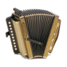

#  Melodeon [](https://github.com/billthefarmer/melodeon/actions) [](https://github.com/billthefarmer/melodeon/releases)
[](https://f-droid.org/packages/org.billthefarmer.melodeon)

An Android melodeon emulator. Emulates a one row melodeon and a one
and a half row organetto. The organetto half row buttons are
reversals. There is a choice of midi intruments and keys. The app is
available on
[F-Droid](https://f-droid.org/packages/org.billthefarmer.melodeon/)
and [here](https://github.com/billthefarmer/melodeon/releases).


&nbsp;


  * Keys: Eb, Bb, F, C, G, D, A
  * Instruments: Standard midi set, defaults to accordion
  * Layouts: Melodeon and organetto.
  * Choice of fascia images

### Playing
Hold the tablet facing away from you the right way up. Play the buttons, touching the vertical grey bar as the bellows. If you don't know how to play button accordion, see http://info.melodeon.net. The buttons may be reversed using the slide button at the bottom.

### External Keyboard
An external USB or Bluetooth keyboard may be used. The keys are...
```
   SDFGHJKL
  ZXCVBNM,./
```
The spacebar, left and right shift keys and left and right control keys
act as the bellows. The function keys and number keys act as the bass
buttons.
